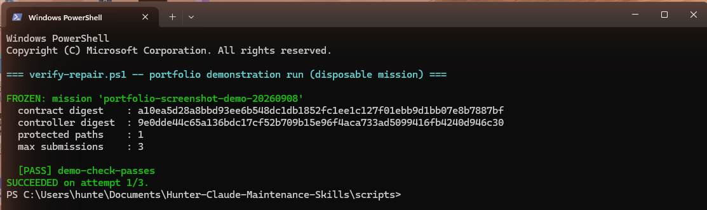
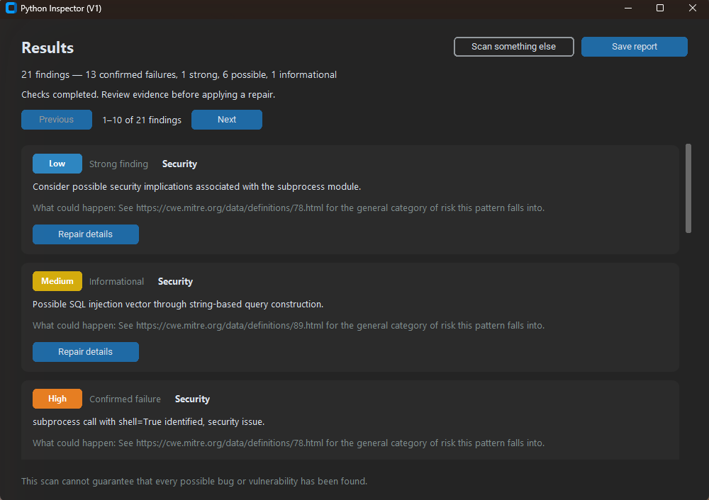

# Hunter Terry — AI Orchestration & Verification

I direct AI coding agents to build software and require evidence before accepting their work. My focus is defining clear tasks, setting permission boundaries, and making sure reported success matches what was actually checked.

**Seeking remote AI implementation, automation, or agent operations opportunities.**  
[GitHub profile](https://github.com/hunter-terry) · [Contact](mailto:hunterterry234@gmail.com)

## Selected work

These four case studies document software development and reliability work in my own environment.

| Project | Problem addressed | Documented result |
|---|---|---|
| [Verification system](01-verification-system/case-study.md) | Agents can claim success without valid checks. | A deterministic controller checks submissions against a frozen contract; 17 adversarial tests passed in the recorded run. |
| [AI-worker supervision](02-fleet-supervision/case-study.md) | Delegated agents can change unrelated files or report environment-specific failures. | Review caught an unauthorized test rewrite; separate execution distinguished sandbox failures from project failures. |
| [Python-Inspector](03-python-inspector/case-study.md) — [public source](https://github.com/hunter-terry/python-inspector) | Code scanning needs useful findings and controlled test execution. | Desktop inspection tool combining five checks and Docker test execution; latest recorded suite (2026-09-09, commit `f36a4af`): 107 passed, 1 skipped; combined suite (adds the separate GUI regression file): 120 passed, 1 skipped, 1 failed (Docker unavailable in that environment). |
| [Evidence-durability repair](04-evidence-durability/case-study.md) | Routine reinstalls removed verification records. | Evidence storage was relocated and checked with per-file hashes across a real reinstall. |

## Additional work

The same validate-before-trust pattern applied to workflow-automation platforms (n8n) instead of standalone scripts. Both repos include a `test-results.md` documenting real runs, not just code read-throughs.

| Project | Problem addressed | Documented result |
|---|---|---|
| [inquiry-triage](https://github.com/hunter-terry/inquiry-triage) | A local model can be talked into saying things it shouldn't (e.g. quoting a price) before a human reviews a draft reply. | A deliberate pricing prompt-injection got the model to comply; the validation layer caught it and flagged it before it reached a reviewer. |
| [lead-qualifier](https://github.com/hunter-terry/lead-qualifier) | A model's own confidence score isn't a safe routing signal on its own. | A prompt-injection attempt inflated a lead's score and was caught by a deterministic check; a follow-up security review then found and closed a gap in that same check using two natural-language attacks with no literal keywords. |

## My contribution

I define the goals and acceptance criteria, choose the tasks and tools, make permission and scope decisions, and review reported outcomes before accepting work.

Claude Code and delegated OpenCode/Codex agents performed implementation and technical checking. The case studies distinguish my direction from agent execution. Separate review sessions and deterministic checks are part of the workflow; they are not claims of an external audit or of code I personally wrote.

## Project previews

**Verification controller** — a disposable demonstration of a frozen contract and a checked result.

**Python-Inspector** — results from a synthetic fixture containing deliberately planted issues.

## Validation and evidence

Controller suite recorded on **September 8, 2026**; Python-Inspector suite
re-verified fresh on **September 9, 2026** (commit `f36a4af`) — see
[Case Study 3](03-python-inspector/case-study.md) for what changed between the
two dates:

| Check | Recorded outcome | Qualification |
|---|---|---|
| Controller adversarial suite | 17 passed, 0 failed | Disposable test fixtures; not proof against an attacker with the same account permissions. |
| Python-Inspector `pytest -q` | 107 passed, 1 skipped; exit 0 | One Docker-daemon-unavailable skip. |
| Python-Inspector combined suite (`pytest tests evidence\verify_ui.py -q -rs`) | 120 passed, 1 skipped, 1 failed | The skip and the failure share one root cause: Docker Desktop's daemon could not be started in this environment. An earlier snapshot of this table reported four GUI-suite failures; re-verification on 2026-09-09 found two were real app bugs (since fixed) and one was a flaky test (since fixed), leaving this one genuine environment gap. |

This repository publishes case studies and screenshots. Implementation
repositories, raw transcripts, and detailed execution records for the
Verification system, AI-worker supervision, and Evidence-durability repair
case studies remain local or private; their paths and commit identifiers are
provenance references, not publicly reproducible evidence.
**Python-Inspector is the exception: its full source, commit history, and
test suite are public** at
[github.com/hunter-terry/python-inspector](https://github.com/hunter-terry/python-inspector).
Test results are historical records; each one states the date and commit it
was measured against rather than being assumed current.

Each case study includes the problem, my role, the implementation, verification results, and limitations.

## Tools used

Claude Code · OpenCode with OpenRouter models · Codex · Python · PowerShell · Docker · Git
